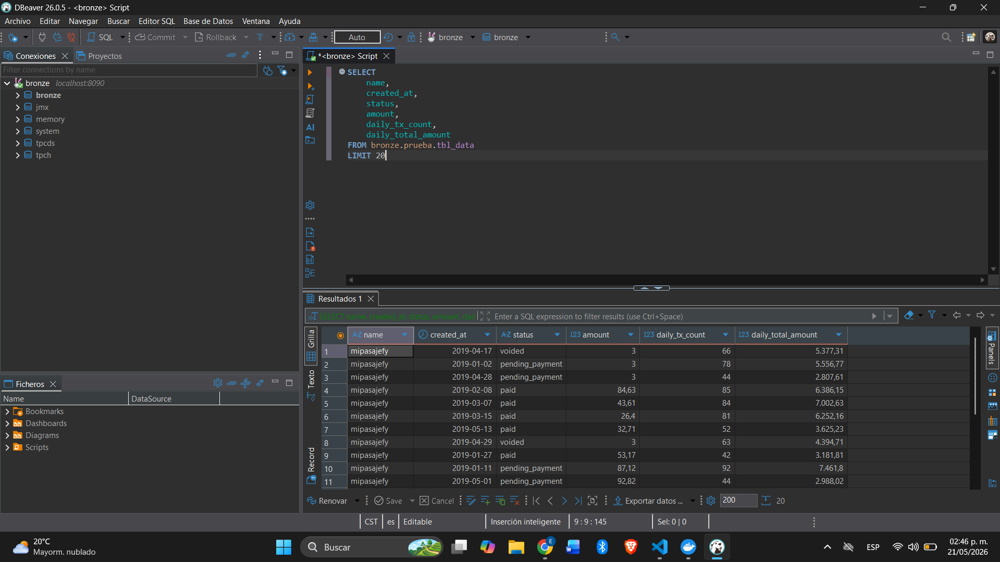

1. Para los IDs nulos ¿qué sugieres hacer con ellos?

En este caso considero que lo mejor es excluir los registros que no tengan ID, ya que el identificador es clave para poder rastrear correctamente cada transacción. Si el ID viene vacío o nulo, no hay una forma confiable de relacionar ese registro con el sistema origen.

Durante el procesamiento filtré esos registros antes de continuar con las transformaciones para evitar inconsistencias posteriores.

Además, una buena práctica sería guardar esos registros en una carpeta o tabla de “cuarentena”, junto con el motivo del rechazo. Esto ayudaría para temas de auditoría o para notificar al equipo encargado de la fuente de datos.

2. Considerando las columnas name y company_id, ¿qué inconsistencias notas y cómo las mitigaste?

Las principales inconsistencias que encontré fueron relacionadas con formato y estandarización.

Por ejemplo:

nombres con espacios al inicio o final,
diferencias entre mayúsculas y minúsculas,
y casos donde aparentemente la misma empresa podía escribirse de distintas maneras.

Esto puede provocar problemas al momento de hacer agrupaciones o métricas, porque el sistema podría interpretar valores iguales como diferentes.

Para mitigarlo:

eliminé espacios innecesarios,
normalicé los textos a minúsculas,
y limpié los campos antes de procesarlos.

También considero que en una solución más robusta sería ideal tener un catálogo maestro de empresas para validar que cada company_id siempre corresponda al mismo nombre estandarizado.

3. Para el resto de los campos, ¿encontraste valores atípicos? ¿Cómo procediste?

Sí, principalmente encontré casos atípicos en el campo amount.

Había transacciones con montos mucho mayores al comportamiento normal del dataset. Para detectar estos casos utilicé un análisis estadístico basado en rangos intercuartiles (IQR), lo cual me permitió identificar registros extremadamente alejados del promedio.

En lugar de eliminar automáticamente todos los valores altos, utilicé una regla un poco más flexible para evitar borrar transacciones legítimas.

También validé otros casos importantes:

registros donde la fecha de pago era anterior a la fecha de creación,
valores nulos esperados dependiendo del status,
y validación de estados permitidos dentro del flujo de negocio.

Cuando un dato no cumplía con las reglas mínimas de consistencia, el registro se descartaba o corregía dependiendo del caso.

4. ¿Qué mejoras propondrías para futuras versiones del proceso ETL?

Considero que hay varias mejoras que podrían hacer el pipeline más robusto y escalable:

Idempotencia

Agregar particionamiento por fecha para evitar sobrescribir información y permitir reejecutar procesos sin duplicar datos.

Manejo de errores

Guardar registros inválidos en una zona de cuarentena para facilitar auditoría y análisis de problemas.

Validaciones automáticas

Implementar validaciones de calidad de datos para detectar inconsistencias antes de cargar información al Data Lake.

Mayor reutilización

Parametrizar el DAG para que pueda reutilizarse fácilmente con diferentes archivos o fuentes de datos.

Separación de capas

Agregar capas tipo Silver y Gold para separar datos limpios de datos ya transformados para analítica.

Monitoreo y alertas

Configurar alertas automáticas cuando falle alguna tarea del pipeline.

Perfilado de datos

Generar reportes automáticos de calidad y comportamiento de los datos antes de cada carga.

## Screenshot — Query en Trino con DBeaver

