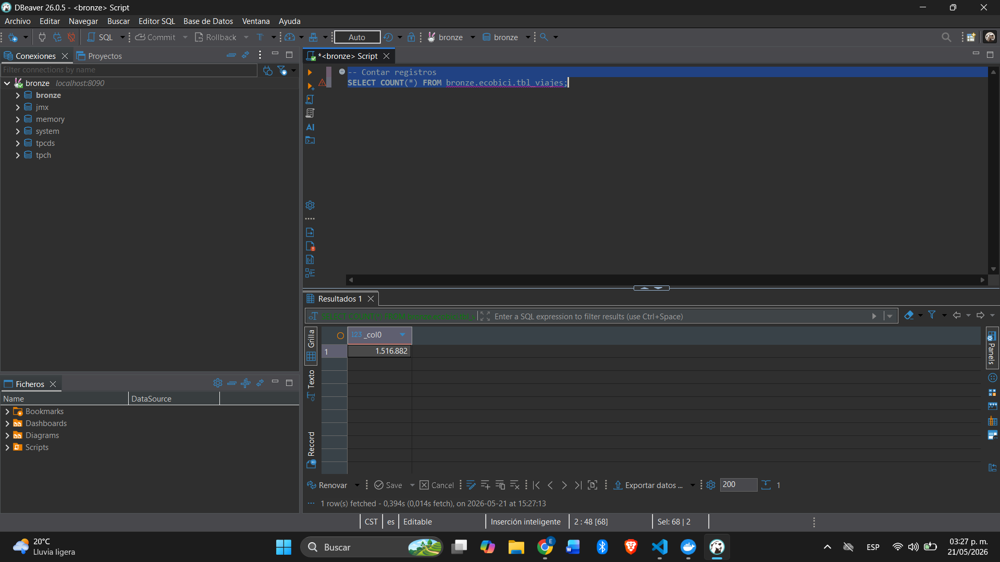
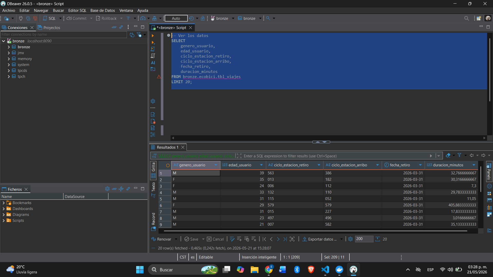
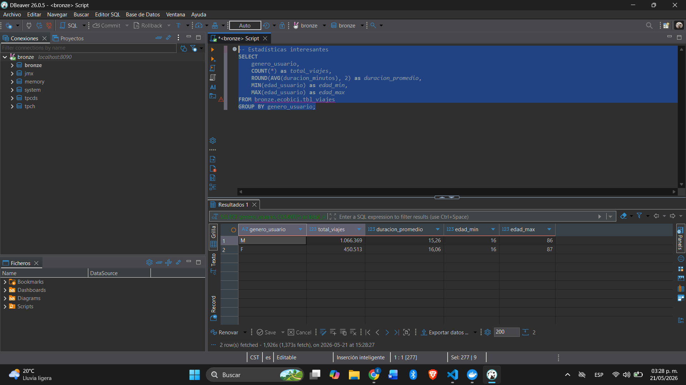

1. ¿Qué dataset se seleccionó para tu flujo?

Para este flujo se seleccionó el dataset de viajes de Ecobici CDMX, específicamente el correspondiente a marzo de 2026, obtenido desde el portal de datos abiertos de Ecobici.

Este dataset contiene información de cada viaje realizado dentro del sistema de bicicletas compartidas, por ejemplo:

género y edad del usuario,
estación de retiro y arribo,
bicicleta utilizada,
fecha y hora del viaje.

La razón principal por la que elegí este dataset es porque tiene un volumen grande de datos, información útil para análisis y un comportamiento muy similar al de un entorno real de datos transaccionales.

Después del proceso de limpieza y transformación se obtuvieron aproximadamente 1.5 millones de viajes válidos, los cuales quedaron disponibles para consulta desde Trino.

2. ¿Qué temporalidad se realizará la extracción y por qué se eligió?

El pipeline se configuró para ejecutarse cada 30 minutos.

Considero que este intervalo es un buen balance entre actualización de datos y consumo de recursos.

Aunque el portal de Ecobici publica archivos históricos mensuales, pensando en un escenario más realista donde existiera una API o una fuente continua de datos, actualizar cada 30 minutos permitiría:

tener información relativamente reciente,
detectar cambios en el uso de estaciones,
y evitar una sobrecarga innecesaria sobre el sistema.

También ayuda a mantener batches pequeños y fáciles de procesar sin necesidad de herramientas más pesadas como Spark.

3. ¿Qué limpieza de datos utilizaste o consideras necesaria?

Durante el procesamiento se aplicaron varias validaciones y limpiezas para asegurar que los datos fueran consistentes y útiles para análisis posteriores.

Las principales fueron:

normalización de nombres de columnas,
eliminación de registros con datos clave faltantes,
validación de género y edades razonables,
corrección y validación de fechas,
eliminación de viajes con duraciones inválidas,
y eliminación de registros duplicados.

Además, el dataset original no incluía directamente la duración del viaje, así que se calculó utilizando la diferencia entre la fecha/hora de retiro y la de arribo.

En general, la idea fue dejar un dataset limpio, consistente y listo para análisis operativos o analíticos.

4. ¿Qué estrategia de partición elegiste y afecta a Trino?

La información se guardó particionada por año y mes, utilizando la fecha de retiro del viaje.

La estructura quedó de esta forma:

bck-bronze/ecobici/year=2026/month=03/ecobici.parquet

Elegí esta estrategia porque la mayoría de los análisis normalmente se realizan por periodos mensuales, por ejemplo:

viajes por mes,
comparativas históricas,
horas pico,
o comportamiento por temporada.

Además, particionar por fecha ayuda a que Trino consulte únicamente las particiones necesarias y no tenga que leer todo el dataset completo, lo cual mejora bastante el rendimiento.

En el caso de Trino, sí es necesario sincronizar las particiones nuevas para que puedan ser detectadas automáticamente. Por eso el pipeline incluye un proceso final que actualiza el catálogo y registra las nuevas particiones disponibles.

También se mantuvo la lógica de dejar un solo archivo parquet por partición para evitar el problema de demasiados archivos pequeños dentro del Data Lake.

5. ¿Cuál fue el reto más grande del proceso?

El reto más complicado fue manejar correctamente la lógica de append manteniendo únicamente un archivo parquet por partición.

Normalmente en un Data Lake cada ejecución agrega un archivo nuevo, pero en este caso el requerimiento era conservar solamente un parquet por ruta.

Eso obligó a implementar un proceso donde:

primero se lee el parquet existente,
luego se combinan los nuevos registros,
se eliminan duplicados,
y finalmente se reescribe el archivo completo.

Aunque funciona correctamente para este volumen de datos, este enfoque puede volverse más pesado conforme el dataset crezca, ya que cada ejecución requiere volver a cargar y escribir el archivo completo.

